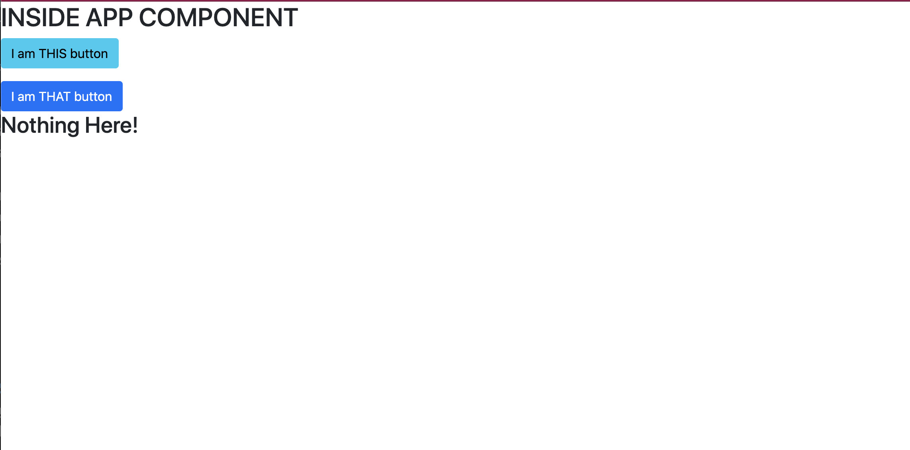

# React Template
[](https://app.netlify.com/sites/react-template-21/deploys)

[See Live Demo of this Template](https://react-template-21.netlify.app/)

This template includes all the dependencies and set up needed for you to work within defined code standards and structure to get you up and running quickly.

## Topics
- [Get Started](#get-started)
- [Starting the Project](#starting-the-project)
- [Other important tidbits](#other-important-tidbits)
    - [React Dev Tools](#react-dev-tools)
    - [Using axios](#using-axios)
    - [Deploying on Netlify](#deploying-on-netlify)
___
## Links to documents:
Wireframs: https://www.figma.com/file/VvOt3aWhcMLN3h20Ufs3Ho/Capstone---Application-Tracking?node-id=2%3A169

Issues:
https://github.com/RKBGK/ApplicationTracker/issues

Stretch Goals
https://github.com/RKBGK/ApplicationTracker/milestone/3

ERD
https://dbdiagram.io/d/61a598ff8c901501c0d87b54

Deployed Site:
https://apptracke16.netlify.app/


## Get Started
### Use Template
#### 1. To get started, click the GREEN "Use this Template" button at the top of the repo


#### 2. Make sure YOUR github account is selected in the dropdown and name your project


3. Clone your new repo to your local machine
4. Go to the **NEXT** section

## Starting the Project
1. Open the `package.json` file and change the `name` property to the name of your application, and `author` to  your name
1. Open the `/public/index.html` file and change the `title` attribute to the name of your application
1. Rename the `.env.local.sample` file to `.env.local` file. The final file name should be `.env.local`
1. From your command line, be in the root directory and run `npm install` OR `npm i` for short
1. From your command line, be in the root directory and run `npx husky install`
1. To start your application, run `npm start`

### If you see this, you are set to go!


**NOTES:** 
- Changes you make to the project will make the browser reload on save...no more hard refresh unless something goes wrong.

## Other Important Tidbits
### React Dev Tools
From this time forward, you will be expected to have a clean console in order for your assignments to be approved. Use [React Developer Tools Chrome Extension](https://chrome.google.com/webstore/detail/react-developer-tools/fmkadmapgofadopljbjfkapdkoienihi?hl=en) to help with debugging.
### Including Images with React
If you have a folder of local images that you want to load into your code things get a little strange with webpack.  Remember the only way webpack knows about assets is if they are imported into your javascript files.  Even our CSS is not added until those files are imported into our javascript files.  Below is some sample code for how to load a local image file into your project

```js
import cat from './assets/cat.jpg';

<>
  
</>

```
### Using Axios
> For every file you will need to make an API request in, you will need to import Axios
```js
import axios from 'axios';

const examplePromise = () => {
  axios.get('http://localhost:3001/example')
    .then((data) => {
      console.warn(data);
    })
    .catch((error) => {
      console.error(error);
    });
});
```

### Deploying on Netlify

- Build Command: `yarn build`
- Publish directory: `build`
- **Add Environmental Variables (NOT REQUIRED for Apps that do not use API Keys, etc)**
    - Any Enviromental variables you are using in your `.env.local` file should be added to Netlify. 
        - Go to Site settings > Build & deploy > Environment > Environment variables and the keys and values there.
- **Update Firebase URL Settings**
    - In Firebase under Authentication select sign in methods, scroll to Authorized domains. Add your Netlify URL.
# Your own learning
If you are interested in setting up your own project for things outside of class, you can run the command to start a React project `npx create-react-app {APP_NAME}` and setup all the files and structures from scratch.
